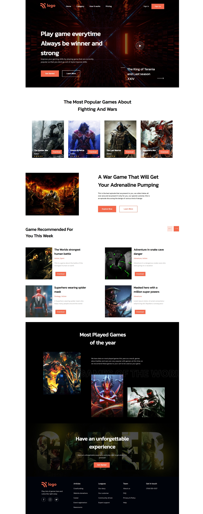

# Full stack JavaScript 2.0

## Gaming landing page

In this project a demo image was given to me and I tried to replicate the same using HTML and CSS. Here I am attaching both files, target image and result.

## Live preview:
https://gaming-landing-souvik-nath.netlify.app/

[HTML File](index.html)

[CSS File](style.css)

>Target image

>My Result

