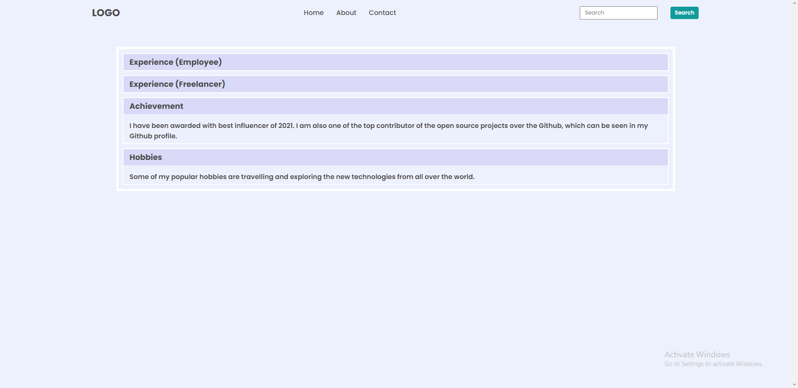
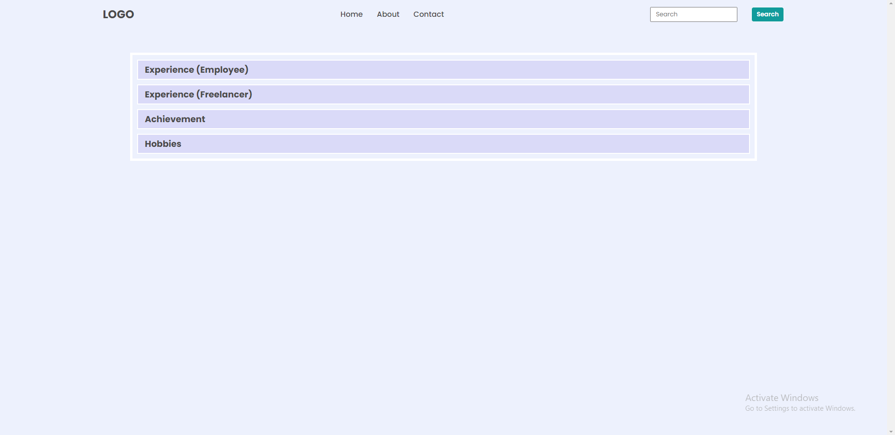
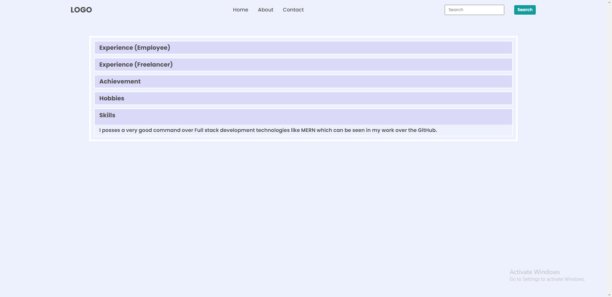

## DOM Assignments FSJS 2.0

## Assignment 2 - Task 1

In this assignment, we have to target the tab's(Skills) background color through DOM and set it same as the images given to us.
Here is the script for that particular task.

```
let btnColor = document.querySelectorAll(".accordian h3");
btnColor.forEach((element)=>{
    element.style.backgroundColor = "#dadaf8";
})
```

[Click Here...](../secondAssignmentsScripts/script.js)

>Before


>After



## Assignment 2 - Task 2

In this assignment, we have to add a new tab named "Skills" and write some information under the tab in the same way like the previous ones.
Here is the script for the particular task.

```
const newDiv = document.createElement("div");
newDiv.className = "accordian h3";
newDiv.innerHTML="<h3>Skills</h3>";
newDiv.style.backgroundColor="#dadaf8"
newDiv.id="skill";
let para = document.createElement("p");
para.innerText="I posses a very good command over Full stack development technologies like MERN which can be seen in my work over the GitHub."
para.style.backgroundColor="#edf1fd"
newDiv.addEventListener("click",()=>{
    newDiv.appendChild(para)
    if (para.style.display === "block") {
        para.style.display = "none";
      } else {
        para.style.display = "block";
      }
})

const target = document.querySelector(".accordian-wrapper");
target.appendChild(newDiv);
```

[Clicl here...](../secondAssignmentsScripts/script2.js)

>Before



>After

