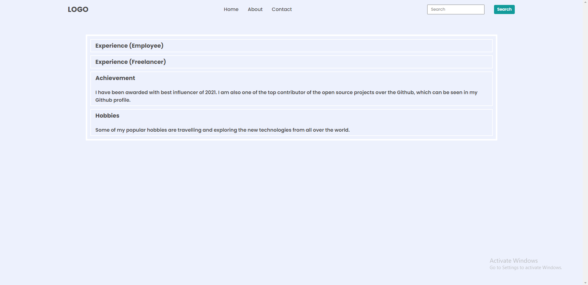

## DOM Assignments FSJS 2.0

## Assignment 2 - Task 1

In this assignment, we have to target the tab's(Skills) background color through DOM and set it same as the images given to us.
Here is the script for that particular task.

[Click Here...](../secondAssignmentsScripts/script.js)

>Before

>After

## Assignment 2 - Task 2

In this assignment, we have to add a new tab named "Skills" and write some information under the tab in the same way like the previous ones.
Here is the script for the particular task.

[Clicl here...](../secondAssignmentsScripts/script2.js)

>Before

>After

