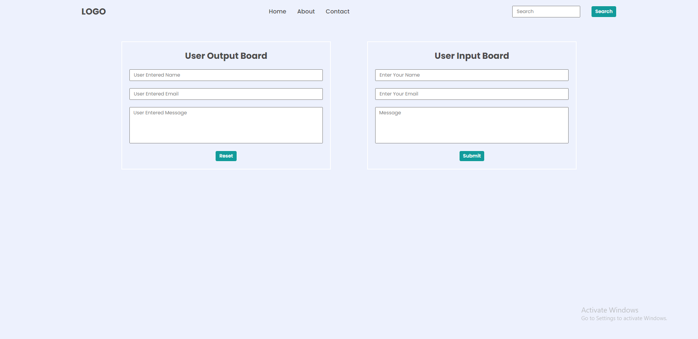
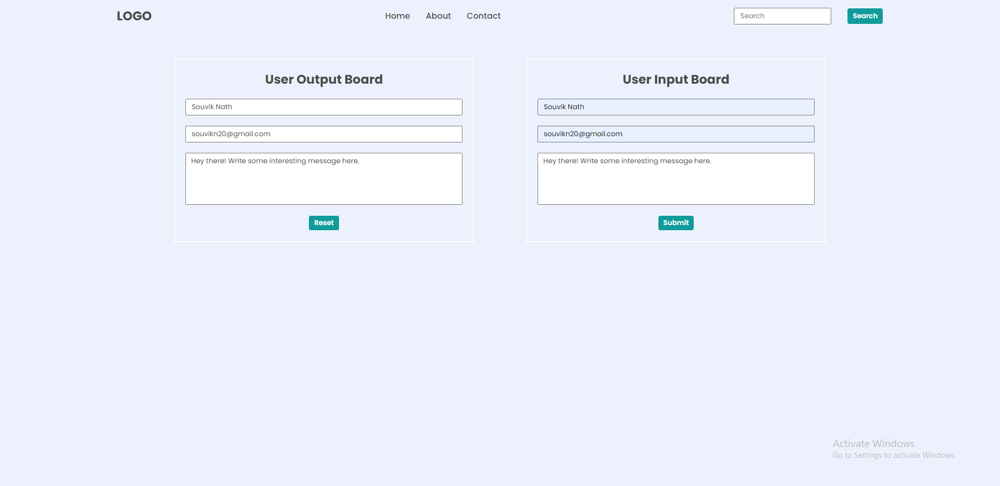

## DOM Assignments FSJS 2.0

## Assignment 3

In this assignment, there are two sides, user input board and user output board. In user input board we fill the form and our task is to collect the data from there and fetch those data to the user output board on clicking "Submit" button. And the user output board data will reset on clicking "Reset" button.

Here is the script for the particular task.

```
const input = document.getElementById("right");

input.addEventListener("submit",(e)=>{
    e.preventDefault();
    name();
    email();
    message();
});


function name() {
    let x = document.getElementById("uname").value;
    document.getElementById("ename").value = x;
}

function email() {
    let x = document.getElementById("uemail").value;
    document.getElementById("eemail").value = x;
}

function message() {
    let x = document.getElementById("umessage").value;
    document.getElementById("emassage").value = x;
}
```

[Click here...](../thirdAssignmentsScript/script.js)

>Before



>After

