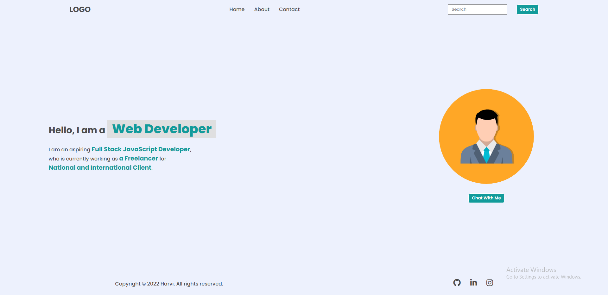
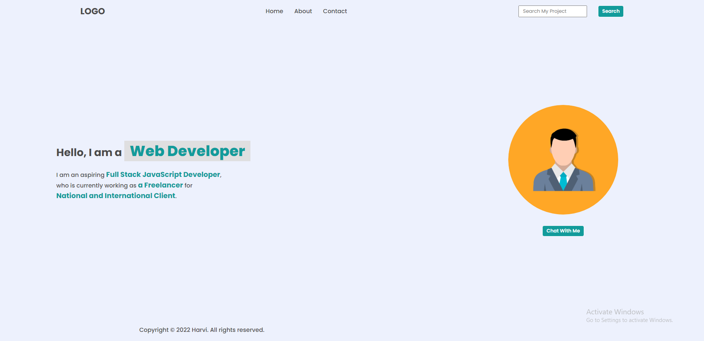
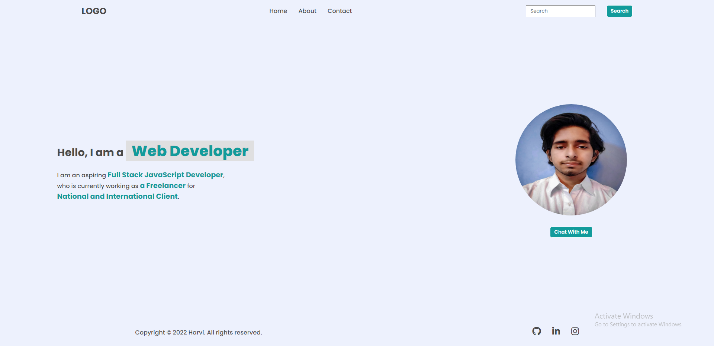
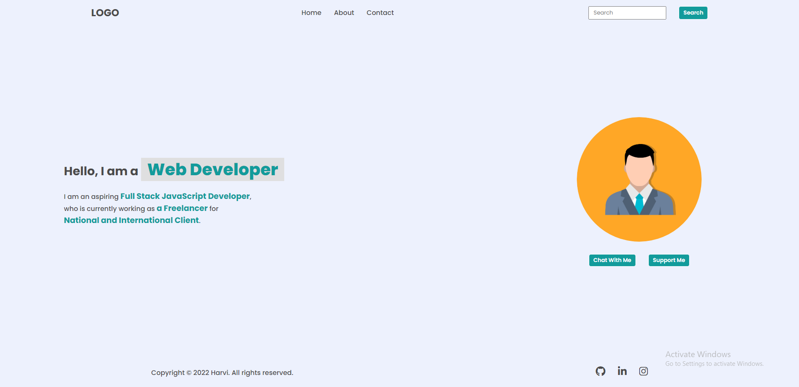

## DOM Assignments FSJS 2.0

## Assignment 1 - Task 1

We have to add a new element(Hire Me) in the navigation bar using DOM. And remove the GitHub, LinkedIn, and Instagram icons from the bottom.
Here is the script for the particular task.

[Click here...](./firstAssignmentScripts/script.js)

>Before

>After

## Assignment 1 - Task 2

Here we have to target the search bar placeholder text and change it accordingly as given to us. And remove the GitHub, LinkedIn, and Instagram icons from the bottom.
Here is the script for the particular task.

[Click here...](./firstAssignmentScripts/script2.js)

>Before

>After

## Assignment 1 - Task 3

Here we have to change the designation from Freelancer to Employee and a company name will replace the national and international client.
Here is the script for the particular task.

[Click Here...](./firstAssignmentScripts/script3.js)

>Before

>After

## Assignment 1 - Task 4

Here we have to target the avatar image using DOM and change it to our own image.
Here is the script for the particular task.

[Click here...](./firstAssignmentScripts/script4.js)

>Before

>After

## Assignment 1 - Task 5

Here we have to add a new button named "Support Me" beside "Chat with me" using DOM.
Here is the script for the particular task.

[Click here...](./firstAssignmentScripts/script5.js)

>Before

>After

## Assignment 2 - [Click here](./about/readme.md)

## Assignment 3 - [Click here](./contact/readme.md)