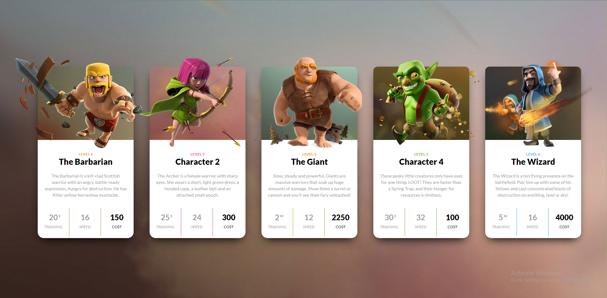
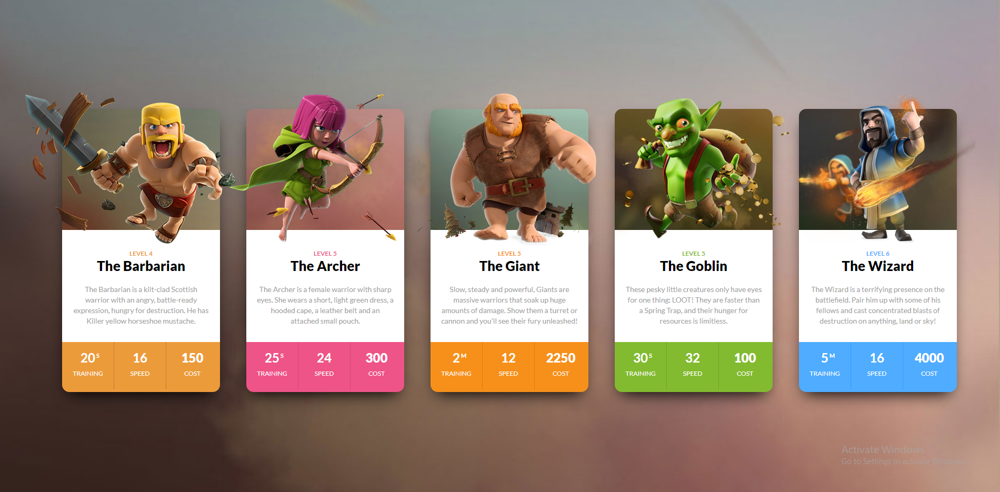

## DOM Assignments FSJS 2.0

## Assignment 4

In this assignment we have a page containing clash of clans game's characters and their abilities. We have to target the background color of the abilities and change some names through this assignment and chage the text color also.

>Before



>After



Here is the script for all the tasks.

```
document.querySelector(".clash-card__unit-stats--barbarian").style.backgroundColor="#ec9b3b";
document.querySelector(".clash-card__unit-stats--archer").style.backgroundColor="#ee5487";
document.querySelector(".clash-card__unit-stats--giant").style.backgroundColor="#f6901a";
document.querySelector(".clash-card__unit-stats--goblin").style.backgroundColor="#82bb30";
document.querySelector(".clash-card__unit-stats--wizard").style.backgroundColor="#4facff";

const textColor = document.getElementsByClassName("one-third");
for (let i = 0; i < textColor.length; i++) {
    textColor[i].style.color="#ffffff";    
}

document.querySelector("#archer").innerText="The Archer";
document.querySelector("#goblin").innerText="The Goblin";
```

I am attaching the file also.

[Click hrer...](./script.js)