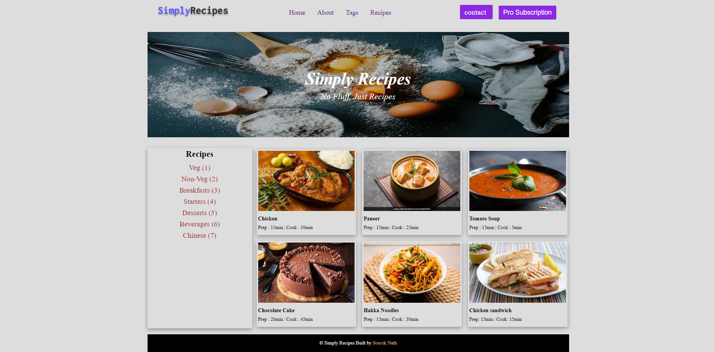

## DOM Assignments FSJS 2.0

## Assignment 5

In this assignment we have to add a new button named "pro subscription" at the nav bar using DOM, we have to add "Chinese (7)" at the recepie section, we have to add a food card like the others one shown here (I added a food card named "Chicken sandwich") and lastly we have to add our name at the footer section.

>Before


>After



Here is the script for all these tasks.

```
const nav = document.querySelector(".btnset");
const newbtn = document.createElement("button");
newbtn.style.backgroundColor = "#8a2be2";
newbtn.innerText="Pro Subscription";
newbtn.style.color="#ffffff";
newbtn.style.fontSize="22px";
newbtn.style.margin="10px";
newbtn.style.padding="10px 15px";
newbtn.style.borderRadius="3px";
newbtn.style.borderStyle="none";
nav.append(newbtn);

const recp = document.querySelector(".recipes-list");
const chinese = document.createElement("a");
chinese.innerText="Chinese (7)";
chinese.style.cursor="pointer"
recp.append(chinese);

const newDiv = document.createElement("div");
newDiv.style.boxShadow="rgba(0, 0, 0, 0.35) 0px 5px 15px";
const recpGal = document.querySelector(".recipe-gallery");
recpGal.appendChild(newDiv);
const img = document.createElement("img");
img.src="./img/chicken sandwich.jpeg";
img.style.width="100%";
img.style.height="200px";
newDiv.appendChild(img);
const H5= document.createElement("h5");
H5.innerText= "Chicken sandwich";
H5.style.fontSize="18px";
H5.style.marginTop="10px";
const P = document.createElement("p");
P.innerText="Prep: 15min | Cook: 15min";
P.style.fontSize="16px";
P.style.margin="10px 0";
newDiv.appendChild(H5);
newDiv.appendChild(P);

document.querySelector("#creatorName").innerText="Souvik Nath";
```
I am attaching the file also.

[Click here...](./script.js)