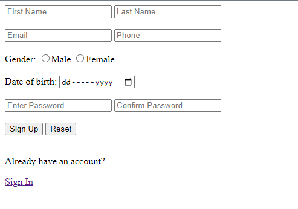
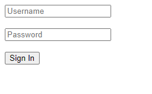
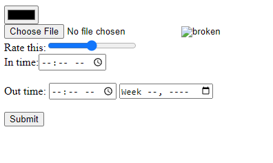
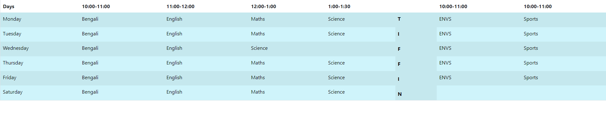
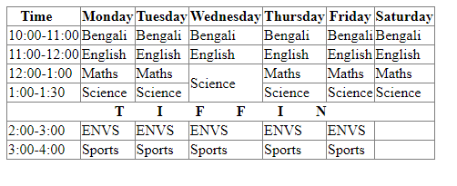
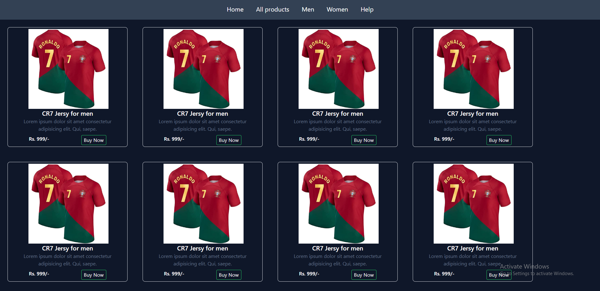

# Home works

Here are some basic home works given by our mentors.

- [User registration form](form.html)

- [Login form](form2.html)

- [Different form attributes usage](form3.html)

- [iFrames usage](iframe.html)

- [Time table using Bootstrap](timetable.html)

- [Time table using just HTML](timetable2.html)

- [Mobile responsive page using Tailwind](twp1.html)

>For desktop

>For Mobile

